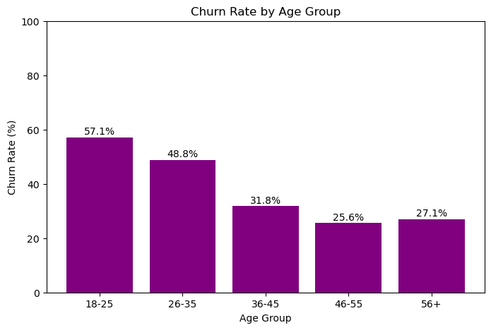
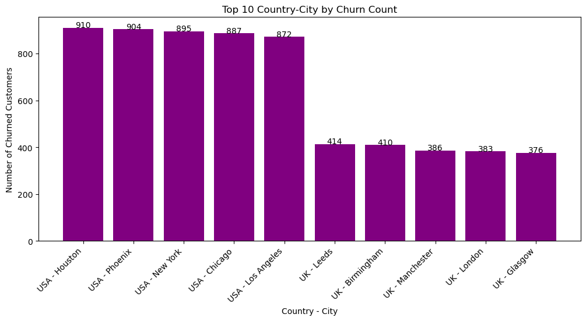
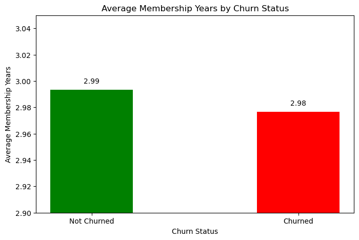
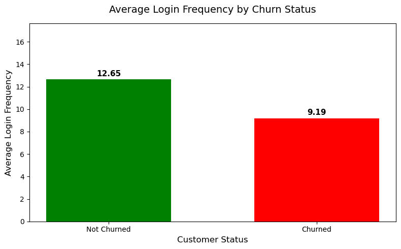
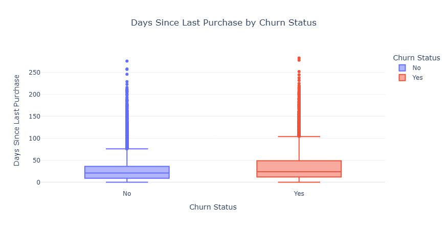
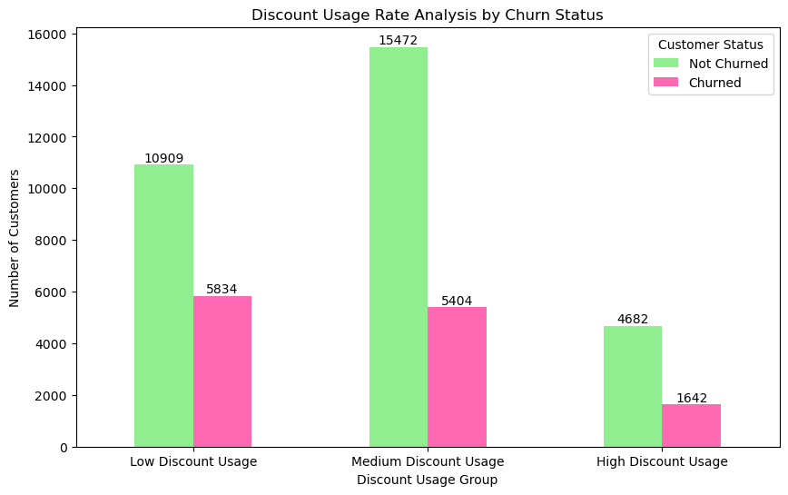
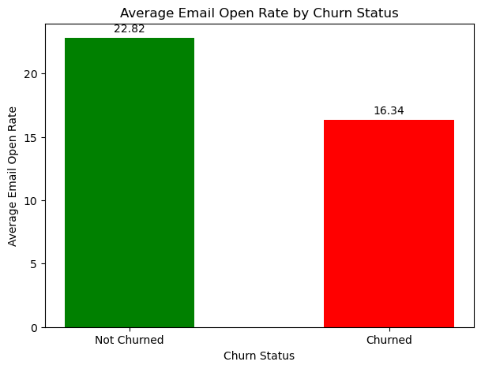
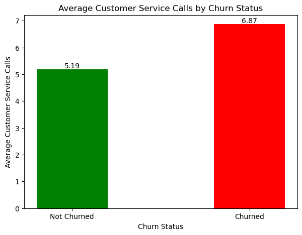
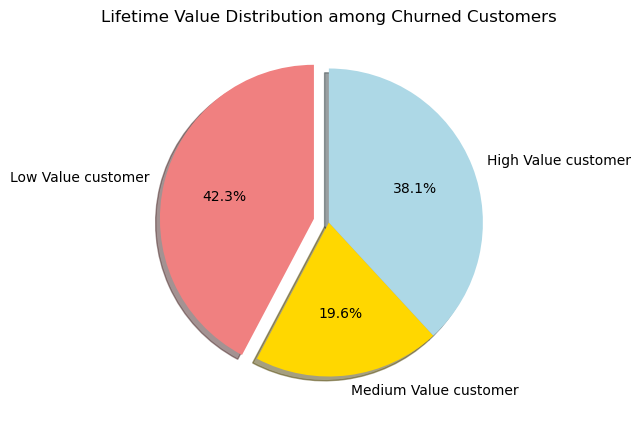
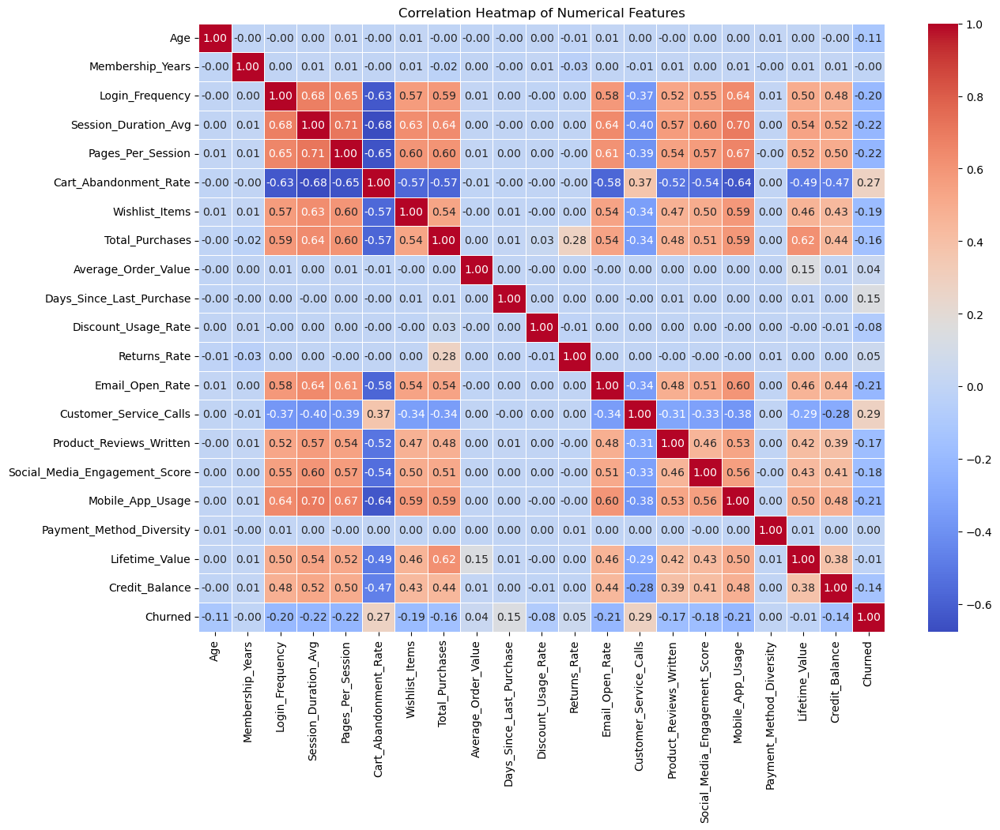

<mark> Project Topic : CustomerMind Analytics<mark>


# Customer Churn Prediction Project

This project analyzes an ecommerce customer churn dataset and builds a machine learning model to predict whether a customer is likely to churn or not. The work is organized step by step from data understanding to final KNN model training.

The project follows this order:

1. `01_data_understanding_cleanng.ipynb` — data understanding, cleaning, KPI calculation, and exploratory analysis  
2. `02_customer_Segmentation.ipynb` — customer segmentation using clustering  
3. `03_hypothesis_testing.ipynb` — statistical testing for feature selection  
4. `04_KNN_model.ipynb` — KNN classification model for churn prediction

// ...existing code...

# CustomerMind Analytics — Visualizations with Conclusions

The following visualizations are produced from `01_data_understanding_cleanng.ipynb`.
The images are stored in the `images/` folder 

Expected image files and short conclusions:

1. Churn Distribution
   

<mark>Conclusion:<mark> 

   - ~29% of customers churn 
   - churn is a significant business issue.

2. Churn Rate by Age Group
   

<mark>Conclusion:<mark> 

- Younger cohorts (18–35) show higher churn; prioritize youth engagement.

3. Top Country-City by Churn Count
   

<mark>Conclusion:<mark> 
   - A few city/regions contribute many churned customers — target local actions.

4. Membership Years vs Churn
   

<mark>Conclusion:<mark> 

   - Average membership years are similar across churn groups — tenure alone is weak.

5. Login Frequency by Churn Status
   

<mark>Conclusion:<mark> 

   - Non-churned customers log in more frequently — engagement reduces churn risk.

6. Session Duration vs Pages Per Session
   

 <mark>Conclusion:<mark>

   - Longer sessions associate with more pages viewed — higher engagement.

7. Total Purchases & Average Order Value by Churn
   

<mark>Conclusion:<mark>

   - Non-churned customers have higher total purchases; AOV differences may indicate different buying patterns.

8. Days Since Last Purchase (Box Plot)
   

<mark>Conclusion:<mark>

   - Churned customers show longer inactivity gaps — re-engagement needed for inactive users.

9. Discount Usage Rate Analysis (counts and churn rate)
   

<mark>Conclusion:<mark>

   - Low discount users show the highest churn rate here — review promo strategy and segmentation.

10. Average Email Open Rate by Churn Status
    

<mark>Conclusion:<mark>

 - Higher email open rates associate with lower churn — email engagement is protective.

11. Customer Service Calls by Churn Status
    

<mark>Conclusion:<mark>

- Churned customers make more service calls on average — unresolved issues may drive churn.

12. Lifetime Value Distribution among Churned Customers
    

<mark>Conclusion:<mark>

- A notable share of churn comes from low-value customers, but high-value churn still requires retention focus.

13. Correlation Heatmap of Numerical Features
    

<mark>Conclusion:<mark>

- Engagement metrics (login, session, pages, email open) negatively correlate with churn; service calls and cart abandonment correlate positively.

How to generate and save images from the notebook (example snippet to add after each plotting cell):

```python
# filepath: (add inside notebook near each plt.show())
plt.savefig("images/churn_distribution.png", bbox_inches="tight")
plt.show()
```


---
## Project Objective

The main objective of this project is to understand customer behavior and predict customer churn. Customer churn means a customer has stopped using or buying from the business.

In this project, the target column is:

```text
Churned
```

Where:

```text
0 = Not Churned
1 = Churned
```

The final machine learning model uses customer behavior, engagement, purchase activity, and service-related features to predict whether a customer may churn.

---

## Dataset Overview

The original dataset contains ecommerce customer behavior information such as age, login frequency, session duration, purchase history, cart abandonment rate, email open rate, customer service calls, lifetime value, and churn status.

Initial dataset size:

```text
Rows: 50,000
Columns: 25
```

After cleaning and filtering, the working dataset contains:

```text
Rows: 43,943
```

---

# 01. Data Understanding and Cleaning

Notebook:

```text
01_data_understanding_cleanng.ipynb
```

The first notebook focuses on understanding the dataset and preparing it for further analysis. The dataset is loaded using pandas, and basic checks such as shape, size, data types, missing values, and sample records are performed.

The dataset had missing values in several columns, including:

- Age
- Session_Duration_Avg
- Pages_Per_Session
- Wishlist_Items
- Days_Since_Last_Purchase
- Discount_Usage_Rate
- Returns_Rate
- Email_Open_Rate
- Customer_Service_Calls
- Product_Reviews_Written
- Social_Media_Engagement_Score
- Mobile_App_Usage
- Payment_Method_Diversity
- Credit_Balance

Missing values were handled using suitable methods such as median, mean, and mode depending on the type and distribution of each column.

The `Age` column was also filtered to remove unrealistic values. After cleaning, all missing values were removed from the dataset.

The cleaned dataset was saved as:

```text
cleaned_dataset.csv
```

## KPI Calculation

After cleaning, important business KPIs were calculated.

Main KPI results:

```text
Total Customers: 43,943
Churned Customers: 12,880
Non-Churned Customers: 31,063
Churn Rate: 29.31%
Retention Rate: 70.69%
Average Lifetime Value: 1441.07
Average Order Value: 123.33
Average Cart Abandonment Rate: 57.03
Average Return Rate: 6.58
Average Email Open Rate: 20.92
Average Login Frequency: 11.63
High-Risk Customers: 12,880
```

These KPIs give a clear overview of the business condition. The churn rate is around 29%, which means almost one-third of customers are leaving. This makes churn prediction important for customer retention.

## Exploratory Data Analysis

Several visual analyses were performed in this notebook.

The main analyses include:

- Churn distribution
- Churn rate by age group
- Churn by country and city
- Purchase behavior by churn status
- Days since last purchase analysis
- Cart abandonment analysis
- Email open rate analysis
- Customer service call analysis
- Lifetime value analysis
- Correlation heatmap

Some important findings from the EDA are:

- Younger customers showed higher churn rates compared to older customers.
- Churned customers had more customer service calls on average.
- Engagement-related features such as login frequency, session duration, pages per session, email open rate, and mobile app usage are important for understanding churn behavior.
- Cart abandonment and customer service calls appear to be strongly connected with churn.
- The company should focus on improving customer engagement, reducing cart abandonment, and solving customer problems earlier.

---

# 02. Customer Segmentation

Notebook:

```text
02_customer_Segmentation.ipynb
```

The second notebook focuses on customer segmentation. Customer segmentation means dividing customers into groups based on their behavior, spending, and engagement.

The purpose of customer segmentation is to understand different types of customers, such as:

- Loyal customers
- High-value customers
- Discount-sensitive customers
- High-risk customers

## Method Used

K-Means clustering was used for segmentation. Before clustering, selected numerical features were scaled using `StandardScaler`, because clustering is distance-based and large-value features can dominate the result if scaling is not applied.

The segmentation features included customer behavior, purchase, engagement, and value-related columns such as:

- Login_Frequency
- Session_Duration_Avg
- Pages_Per_Session
- Cart_Abandonment_Rate
- Total_Purchases
- Average_Order_Value
- Days_Since_Last_Purchase
- Discount_Usage_Rate
- Email_Open_Rate
- Customer_Service_Calls
- Mobile_App_Usage
- Lifetime_Value

## Finding Number of Clusters

The elbow method was used to decide a suitable number of clusters. Based on the analysis, the notebook used:

```text
Number of clusters = 4
```

The customer groups were created using K-Means clustering.

Cluster sizes:

```text
Cluster 0: 12,227 customers
Cluster 1: 7,222 customers
Cluster 2: 9,462 customers
Cluster 3: 15,032 customers
```

## PCA Analysis

PCA was used to reduce the feature dimensions and visualize customer groups more clearly. PCA helps show customer patterns in a smaller number of dimensions while keeping important information from the original features.

The clustering and PCA analysis helped identify how customers are grouped based on engagement, purchase behavior, email activity, mobile app usage, and lifetime value.

This segmentation can help the business create different strategies for different customer groups instead of treating all customers the same way.

---

# 03. Hypothesis Testing

Notebook:

```text
03_hypothesis_testing.ipynb
```

The third notebook focuses on hypothesis testing for feature selection before machine learning model training.

The target column is:

```text
Churned
```

The features were separated into two groups:

```text
Numerical features
Categorical features
```

For hypothesis testing:

```text
Numerical feature vs Churned    → Two-sample t-test
Categorical feature vs Churned  → Chi-square test
```

The significance level used was:

```text
alpha = 0.05
```

This means:

```text
p-value < 0.05  → Feature is statistically significant
p-value >= 0.05 → Feature is not statistically significant
```

## Two-Sample T-Test

The numerical feature tested was:

```text
Customer_Service_Calls
```

Question:

```text
Is the average Customer_Service_Calls different between churned and non-churned customers?
```

Hypotheses:

```text
H0: The average Customer_Service_Calls is the same for churned and non-churned customers.
H1: The average Customer_Service_Calls is different for churned and non-churned customers.
```

Result:

```text
T-statistic: 62.0564
P-value: 0.0
```

Conclusion:

Since the p-value is less than 0.05, the null hypothesis is rejected. This means the average number of customer service calls is significantly different between churned and non-churned customers.

This feature is useful because customers who contact customer service more often may be facing more problems, which can increase the chance of churn.

## Chi-Square Test

The categorical feature tested was:

```text
Signup_Quarter
```

Question:

```text
Is customer churn associated with Signup_Quarter?
```

Hypotheses:

```text
H0: Signup_Quarter and customer churn are independent.
H1: Signup_Quarter and customer churn are associated.
```

Result:

```text
Chi-square statistic: 8.5456
P-value: 0.03598
Degrees of freedom: 3
```

Conclusion:

Since the p-value is less than 0.05, the null hypothesis is rejected. This means Signup_Quarter has a statistically significant association with customer churn.

After hypothesis testing, the selected features were used for KNN model training.

---

# 04. KNN Model for Customer Churn Prediction

Notebook:

```text
04_KNN_model.ipynb
```

The fourth notebook builds the final machine learning model using KNN classification.

KNN was selected because the problem is a classification problem. The model predicts whether a customer belongs to class 0 or class 1.

```text
0 = Not Churned
1 = Churned
```

## Selected Features

The model uses features selected after analysis and hypothesis testing.

Numerical features:

```text
Customer_Service_Calls
Cart_Abandonment_Rate
Pages_Per_Session
Session_Duration_Avg
Email_Open_Rate
Mobile_App_Usage
Login_Frequency
Total_Purchases
Days_Since_Last_Purchase
```

Categorical feature:

```text
Signup_Quarter
```

## Data Splitting

The data was split into training and testing data.

```text
Training data: 80%
Testing data: 20%
```

The split used `stratify=y` so that the proportion of churned and non-churned customers stays balanced in both training and testing data.

## Preprocessing

A machine learning pipeline was created using:

```text
StandardScaler for numerical features
OneHotEncoder for categorical features
KNeighborsClassifier for prediction
```

Scaling is very important for KNN because KNN works based on distance. Without scaling, features with large values can dominate the prediction.

One-hot encoding was used for `Signup_Quarter` because machine learning models need numerical input, not text categories.

## Choosing K Value

The elbow method was used to check the error rate for K values from 1 to 20.

In the final model, the selected K value was:

```text
K = 7
```

This means the model checks the 7 nearest customers before deciding whether a new customer is likely to churn or not.

## Model Performance

The final KNN model performance was:

```text
Accuracy: 0.7889
Precision: 0.7205
Recall: 0.4573
F1 Score: 0.5595
```

Confusion matrix:

```text
[[5756  457]
 [1398 1178]]
```

Classification report summary:

```text
Class 0 - Not Churned:
Precision: 0.80
Recall: 0.93
F1-score: 0.86

Class 1 - Churned:
Precision: 0.72
Recall: 0.46
F1-score: 0.56
```

The model predicts non-churned customers well, but recall for churned customers is moderate. This means the model misses some actual churned customers. For a business churn problem, recall is important because missing churned customers means the company may lose customers without taking action.

## New Customer Prediction

The notebook also predicts churn for new customer records. Three sample customers were given as input, and the model predicted whether each customer is churned or not.

Example output:

```text
Customer 1: Not Churned
Customer 2: Not Churned
Customer 3: Churned
```

This shows how the trained KNN pipeline can be used for future customer churn prediction.

---

## Tools and Libraries Used

The main tools and libraries used in this project are:

```text
Python
Pandas
NumPy
Matplotlib
Seaborn
Scikit-learn
SciPy
Jupyter Notebook
```

Main machine learning and statistical methods:

```text
Data Cleaning
Exploratory Data Analysis
KPI Calculation
K-Means Clustering
PCA
Two-Sample T-Test
Chi-Square Test
KNN Classification
Elbow Method
Confusion Matrix
Classification Report
```

---

## How to Run the Project

Run the notebooks in this order:

```text
01_data_understanding_cleanng.ipynb
02_customer_Segmentation.ipynb
03_hypothesis_testing.ipynb
04_KNN_model.ipynb
```

The first notebook creates the cleaned dataset. The later notebooks depend on this cleaned dataset, so the first notebook should be completed before running the others.

Required dataset files:

```text
ecommerce_customer_churn_dataset.csv
cleaned_dataset.csv
```

If `cleaned_dataset.csv` is not available, run the first notebook again to generate it.

---

## Final Conclusion

This project successfully analyzes customer churn using a complete data science workflow. First, the dataset was cleaned and explored. Then, important business KPIs and visualizations were created to understand customer behavior. After that, customer segmentation was performed using K-Means clustering to divide customers into meaningful groups.

Hypothesis testing was used to select important features before model training. The two-sample t-test showed that customer service calls are significantly different between churned and non-churned customers. The chi-square test showed that signup quarter is associated with churn.

Finally, a KNN classification model was trained to predict customer churn. The model achieved around 79% accuracy. The result shows that customer engagement, service issues, purchase behavior, and inactivity are important factors for predicting churn.

Overall, this project can help a business identify customers who are at risk of leaving and take action through better support, engagement campaigns, and retention strategies.

---

## Future Improvements

The project can be improved further by:

- Improving recall for churned customers
- Using cross-validation for more stable evaluation
- Applying advanced feature engineering
- Creating a Streamlit dashboard for business users
- Adding customer retention recommendations based on prediction results

